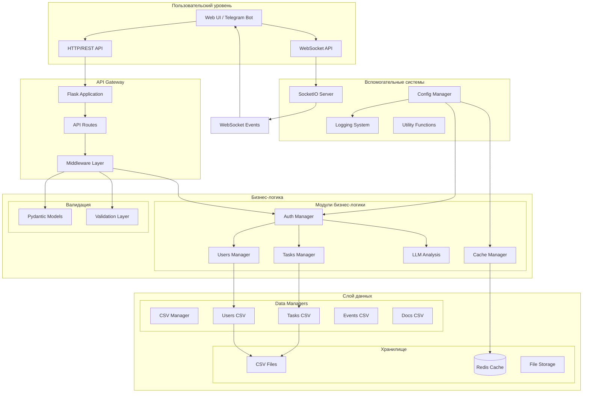
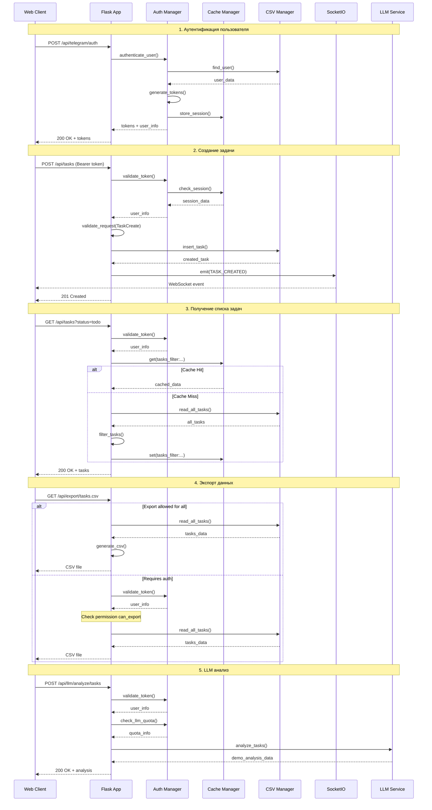

# Архитектура Task Management System



## Детальная архитектура системы

### **1. Уровень представления (Presentation Layer)**

```
┌─────────────────────────────────────────────────────────────┐
│                    Presentation Layer                        │
├─────────────────────────────────────────────────────────────┤
│                                                            │
│  ┌─────────────┐    ┌─────────────┐    ┌──────────────┐  │
│  │   Web UI    │    │  API Client │    │ Telegram Bot │  │
│  │  (React)    │    │   (Mobile)  │    │              │  │
│  └──────┬──────┘    └──────┬──────┘    └──────┬───────┘  │
│         │                  │                   │          │
│  ┌──────▼──────┐    ┌──────▼──────┐    ┌──────▼───────┐  │
│  │   REST API  │◄───┤   HTTP/1.1  │◄───┤  Webhooks    │  │
│  │  (Flask)    │    │             │    │              │  │
│  └──────┬──────┘    └─────────────┘    └──────────────┘  │
│         │                                                │
│  ┌──────▼──────┐                                         │
│  │ WebSocket   │                                         │
│  │   API       │                                         │
│  └─────────────┘                                         │
└───────────────────────────────────────────────────────────┘
```

**Компоненты:**
- **Flask Application** (`app.py`) - Основное приложение
- **REST API Endpoints** - 12+ эндпоинтов
- **WebSocket Server** - Реальное время
- **CORS Middleware** - Межсайтовые запросы

### **2. Слой API и маршрутизации (API Gateway Layer)**

```
┌─────────────────────────────────────────────────────────────┐
│                    API Gateway Layer                         │
├─────────────────────────────────────────────────────────────┤
│                                                            │
│  ┌────────────────────────────────────────────────────┐  │
│  │                Flask Route Registry                │  │
│  ├────────────────────────────────────────────────────┤  │
│  │ GET  /api/health              │ Health check      │  │
│  │ POST /api/telegram/auth       │ Authentication    │  │
│  │ GET  /api/tasks               │ List tasks        │  │
│  │ POST /api/tasks               │ Create task       │  │
│  │ PUT  /api/tasks/{id}          │ Update task       │  │
│  │ GET  /api/export/tasks.csv    │ Export tasks      │  │
│  │ POST /api/llm/analyze/tasks   │ LLM analysis      │  │
│  │ POST /api/users               │ Create user       │  │
│  └────────────────────────────────────────────────────┘  │
│                                                            │
│  ┌────────────────────────────────────────────────────┐  │
│  │              Request Pipeline                      │  │
│  ├────────────────────────────────────────────────────┤  │
│  │ 1. Request → 2. CORS → 3. Auth → 4. Validation    │  │
│  │ 5. Business Logic → 6. Response → 7. Logging      │  │
│  └────────────────────────────────────────────────────┘  │
└───────────────────────────────────────────────────────────┘
```

**Декораторы middleware:**
- `@require_auth` - Проверка аутентификации
- `@require_permission` - Проверка прав (упрощена)
- `@validate_request` - Валидация Pydantic
- `@generate_response` - Стандартизация ответов

### **3. Слой бизнес-логики (Business Logic Layer)**

```
┌─────────────────────────────────────────────────────────────┐
│                Business Logic Layer                          │
├─────────────────────────────────────────────────────────────┤
│                                                            │
│  ┌────────────────────────────────────────────────────┐  │
│  │              Authentication Service                │  │
│  ├────────────────────────────────────────────────────┤  │
│  │ • JWT token generation & validation               │  │
│  │ • User session management                         │  │
│  │ • Permission checking (simplified)                │  │
│  │ • Role-based access control                       │  │
│  │ • Telegram username validation                    │  │
│  └───────────────────┬────────────────────────────────┘  │
│                      │                                    │
│  ┌───────────────────▼────────────────────────────────┐  │
│  │                Task Management                      │  │
│  ├────────────────────────────────────────────────────┤  │
│  │ • CRUD operations for tasks                        │  │
│  │ • Filtering, sorting, pagination                   │  │
│  │ • Tag management                                   │  │
│  │ • Assignment tracking                              │  │
│  │ • Deadline calculations                            │  │
│  └───────────────────┬────────────────────────────────┘  │
│                      │                                    │
│  ┌───────────────────▼────────────────────────────────┐  │
│  │              Data Analysis (LLM)                    │  │
│  ├────────────────────────────────────────────────────┤  │
│  │ • Productivity metrics                             │  │
│  │ • Bottleneck detection                             │  │
│  │ • Team performance analysis                        │  │
│  │ • Predictive analytics                             │  │
│  │ • Demo mode with sample data                       │  │
│  └────────────────────────────────────────────────────┘  │
│                                                            │
│  ┌────────────────────────────────────────────────────┐  │
│  │                User Management                     │  │
│  ├────────────────────────────────────────────────────┤  │
│  │ • User registration & profile                      │  │
│  │ • Role assignment                                 │  │
│  │ • Activity tracking                               │  │
│  │ • Department management                           │  │
│  └────────────────────────────────────────────────────┘  │
└───────────────────────────────────────────────────────────┘
```

### **4. Слой данных (Data Layer)**

```
┌─────────────────────────────────────────────────────────────┐
│                    Data Access Layer                         │
├─────────────────────────────────────────────────────────────┤
│                                                            │
│  ┌────────────────────────────────────────────────────┐  │
│  │             CSV Data Manager (Thread-safe)         │  │
│  ├────────────────────────────────────────────────────┤  │
│  │ • Thread locking for safe concurrent access       │  │
│  │ • Schema validation                               │  │
│  │ • Automatic ID generation                         │  │
│  │ • Timestamp management                            │  │
│  │ • Batch operations                                │  │
│  └───────┬─────────────────────────────────────────────┘  │
│          │                                                 │
│  ┌───────┼─────────────────────────────────────────────┐  │
│  │       ▼                                             │  │
│  │ ┌──────────┐  ┌──────────┐  ┌──────────┐  ┌──────┐ │  │
│  │ │  Users   │  │  Tasks   │  │  Events  │  │ Docs │ │  │
│  │ │ Manager  │  │ Manager  │  │ Manager  │  │Manager│ │  │
│  │ └─────┬────┘  └─────┬────┘  └─────┬────┘  └──┬───┘ │  │
│  │       │             │              │          │     │  │
│  │ ┌─────▼─────┐ ┌─────▼─────┐ ┌─────▼─────┐ ┌──▼───┐ │  │
│  │ │ users.csv │ │ tasks.csv │ │events.csv │ │docs.csv│ │  │
│  │ └───────────┘ └───────────┘ └───────────┘ └──────┘ │  │
│  └─────────────────────────────────────────────────────┘  │
│                                                            │
│  ┌────────────────────────────────────────────────────┐  │
│  │                Cache Layer                         │  │
│  ├────────────────────────────────────────────────────┤  │
│  │ • Redis (primary)                                 │  │
│  │ • In-memory fallback                              │  │
│  │ • TTL-based expiration                            │  │
│  │ • Cache key generation                            │  │
│  │ • Session storage                                 │  │
│  └────────────────────────────────────────────────────┘  │
└───────────────────────────────────────────────────────────┘
```

### **5. Слой конфигурации и инфраструктуры**

```
┌─────────────────────────────────────────────────────────────┐
│         Configuration & Infrastructure Layer                 │
├─────────────────────────────────────────────────────────────┤
│                                                            │
│  ┌────────────────────────────────────────────────────┐  │
│  │            Configuration Manager                   │  │
│  ├────────────────────────────────────────────────────┤  │
│  │ • YAML file loading                               │  │
│  │ • Environment variable substitution               │  │
│  │ • Hierarchical configuration                      │  │
│  │ • Default values                                  │  │
│  │ • Feature toggles                                │  │
│  └────────────────────────────────────────────────────┘  │
│                                                            │
│  ┌────────────────────────────────────────────────────┐  │
│  │              Logging System                        │  │
│  ├────────────────────────────────────────────────────┤  │
│  │ • Rotating file logs                              │  │
│  │ • Console output                                  │  │
│  │ • Log levels (DEBUG, INFO, WARN, ERROR)          │  │
│  │ • Structured logging                              │  │
│  │ • Log retention policies                          │  │
│  └────────────────────────────────────────────────────┘  │
│                                                            │
│  ┌────────────────────────────────────────────────────┐  │
│  │              Monitoring & Health                   │  │
│  ├────────────────────────────────────────────────────┤  │
│  │ • /api/health endpoint                            │  │
│  │ • Component status checks                         │  │
│  │ • Performance metrics                             │  │
│  │ • Uptime tracking                                 │  │
│  └────────────────────────────────────────────────────┘  │
└───────────────────────────────────────────────────────────┘
```

## Детальная схема взаимодействия компонентов



## 📁 Полная структура файловой системы

```
task_management_system/
├── modules/                          # Основные модули
│   ├── __init__.py                   # Пакет модулей
│   ├── constants.py                  # Константы и настройки
│   │   ├── SystemConstants           # Все системные константы
│   │   ├── ROLES, TASK_STATUSES      # Перечисления
│   │   ├── CSV_PATHS                 # Пути к файлам
│   │   └── SCHEMAS                   # CSV схемы
│   │
│   ├── models.py                     # Pydantic модели
│   │   ├── UserBase, UserCreate      # Модели пользователей
│   │   ├── TaskBase, TaskCreate      # Модели задач
│   │   ├── AuthRequest, AuthResponse # Модели аутентификации
│   │   ├── TaskUpdate                # Модель обновления задачи
│   │   └── LLMAnalysisRequest        # Модель LLM анализа
│   │
│   ├── config_manager.py             # Управление конфигурацией
│   │   ├── ConfigManager             # Основной класс
│   │   ├── _load_config()            # Загрузка из YAML
│   │   ├── _replace_env_vars()       # Замена переменных окружения
│   │   ├── get()                     # Получение значения
│   │   └── is_security_enabled()     # Проверки конфигурации
│   │
│   ├── csv_manager.py                # Управление CSV
│   │   ├── CSVDataManager            # Потокобезопасный менеджер
│   │   ├── read_all(), write_all()   # Чтение/запись
│   │   ├── find(), find_one()        # Поиск
│   │   ├── insert()                  # Вставка
│   │   ├── update()                  # Обновление
│   │   └── delete()                  # Удаление
│   │
│   ├── cache_manager.py              # Кэширование
│   │   ├── CacheManager              # Менеджер кэша
│   │   ├── get(), set(), delete()    # Основные операции
│   │   ├── generate_key()            # Генерация ключей
│   │   └── Redis + in-memory fallback
│   │
│   ├── auth_manager.py               # Аутентификация и авторизация
│   │   ├── AuthManager               # Основной класс
│   │   ├── authenticate_user()       # Аутентификация
│   │   ├── validate_token()          # Валидация токенов
│   │   ├── refresh_access_token()    # Обновление токенов
│   │   ├── check_permission()        # Проверка прав
│   │   ├── get_user_llm_quota()      # Квоты LLM
│   │   └── logout()                  # Выход из системы
│   │
│   ├── decorators.py                 # Декораторы и middleware
│   │   ├── require_auth()            # Требование аутентификации
│   │   ├── require_permission()      # Требование прав
│   │   ├── validate_request()        # Валидация запросов
│   │   └── generate_response()       # Стандартизация ответов
│   │
│   ├── websocket.py                  # WebSocket обработчики
│   │   ├── WebSocketHandler          # Основной класс
│   │   ├── handle_connect()          # Подключение
│   │   ├── handle_subscribe()        # Подписка на каналы
│   │   └── handle_disconnect()       # Отключение
│   │
│   ├── utils.py                      # Утилиты
│   │   ├── initialize_sample_data()  # Инициализация данных
│   │   └── Вспомогательные функции
│   │
│   └── api/                          # API endpoints
│       ├── __init__.py
│       ├── auth.py                   # Аутентификация API
│       │   ├── AuthAPI               # Класс API
│       │   ├── telegram_auth_endpoint()
│       │   ├── refresh_token_endpoint()
│       │   └── logout_endpoint()
│       │
│       ├── tasks.py                  # Задачи API
│       │   ├── TasksAPI              # Класс API
│       │   ├── get_tasks_endpoint()
│       │   ├── create_task_endpoint()
│       │   └── update_task_endpoint()
│       │
│       ├── users.py                  # Пользователи API
│       │   ├── UsersAPI              # Класс API
│       │   └── create_user_endpoint()
│       │
│       ├── export.py                 # Экспорт API
│       │   ├── ExportAPI             # Класс API
│       │   └── export_tasks_csv_endpoint()
│       │
│       └── llm.py                    # LLM API
│           ├── LLMAPI                # Класс API
│           └── analyze_tasks_llm_endpoint()
│
├── tests/                           # Тесты
│   ├── __init__.py
│   ├── test_constants.py            # Тесты констант
│   ├── test_config_manager.py       # Тесты конфигурации
│   ├── test_csv_manager.py          # Тесты CSV менеджера
│   ├── test_auth_manager.py         # Тесты аутентификации
│   ├── test_models.py               # Тесты моделей
│   ├── test_decorators.py           # Тесты декораторов
│   ├── test_api_auth.py             # Тесты API аутентификации
│   ├── test_api_tasks.py            # Тесты API задач
│   ├── test_integration.py          # Интеграционные тесты
│   └── run_tests.py                 # Запуск всех тестов
│
├── data/                            # Данные (CSV файлы)
│   ├── users.csv                    # Пользователи
│   ├── tasks.csv                    # Задачи
│   ├── events.csv                   # События
│   └── docs.csv                     # Документы
│
├── logs/                            # Логи
│   └── task_system.log              # Основной лог файл
│
├── config.yaml                      # Конфигурация
├── .env                             # Переменные окружения
├── requirements.txt                 # Зависимости
├── app.py                           # Основной файл приложения
└── README.md                        # Документация
```

## 🔄 Потоки данных

### Поток создания задачи:

```
1. Клиент → POST /api/tasks (JSON + Bearer Token)
2. Flask → проверка CORS
3. Декоратор @require_auth → проверка токена
4. Декоратор @validate_request → валидация Pydantic
5. TasksAPI.create_task_endpoint():
   - Проверка существования assignee
   - Генерация task_id
   - Подготовка данных для CSV
   - CSVManager.insert()
   - WebSocket.emit(TASK_CREATED)
6. Генерация стандартизированного ответа
7. Возврат клиенту
```

### Поток аутентификации:

```
1. Клиент → POST /api/telegram/auth (telegram_username)
2. Flask → @validate_request
3. AuthAPI.telegram_auth_endpoint():
   - AuthManager.authenticate_user()
   - Поиск в CSVManager
   - Если не найден → создание нового пользователя
   - Генерация JWT токенов
   - Сохранение сессии в CacheManager
   - Сохранение в Flask session
4. Возврат токенов клиенту
```

## 🎯 Ключевые архитектурные решения

### 1. **Многослойная архитектура**
- Presentation Layer (API Gateway)
- Business Logic Layer (Сервисы)
- Data Access Layer (Менеджеры)
- Infrastructure Layer (Конфигурация, логирование)

### 2. **Принцип единой ответственности (SRP)**
- Каждый модуль отвечает за одну задачу
- Четкое разделение между аутентификацией, бизнес-логикой, данными

### 3. **Декомпозиция на микросервисы (в монолите)**
- Независимые API модули
- Возможность выноса в отдельные сервисы

### 4. **Стратегия кэширования**
- Redis как основной кэш
- In-memory fallback
- Интеллектуальная генерация ключей кэша
- TTL на основе использования данных

### 5. **Безопасность**
- JWT токены (access + refresh)
- Валидация входных данных (Pydantic)
- Защита от CSRF (CORS настройки)
- Хранение секретов в переменных окружения

### 6. **Масштабируемость**
- Потокобезопасный доступ к CSV
- Кэширование часто запрашиваемых данных
- Пагинация для больших наборов данных
- WebSocket для реальных обновлений

## 📊 Структура данных

### Пользователи (users.csv):
```csv
telegram_username,full_name,role,is_active,registered_at,last_login,email,department
@admin_ivan,Иван Петров,admin,True,2024-01-15 10:30:00,2024-01-20 14:25:00,ivan@company.com,IT
@developer_alex,Алексей Козлов,member,True,2024-01-16 09:15:00,2024-01-20 16:40:00,alex@company.com,Development
```

### Задачи (tasks.csv):
```csv
task_id,title,description,status,assignee,creator,created_at,updated_at,due_date,completed_at,priority,tags
101,Разработка REST API,Создать API endpoints,in_progress,@developer_alex,@manager_anna,2024-01-18 11:00:00,2024-01-19 15:30:00,2024-01-25,,high,["backend","api","priority"]
102,Исправить баг,Ошибка при сохранении,done,@developer_alex,@admin_ivan,2024-01-17 14:20:00,2024-01-18 10:15:00,2024-01-18,2024-01-18 10:15:00,urgent,["bug","critical"]
```

## 🔧 Конфигурационные параметры

### Безопасность:
- `security.enabled`: Включение/выключение безопасности
- `security.session_timeout_hours`: Время жизни сессии
- `security.rate_limiting`: Ограничение запросов

### Производительность:
- `performance.cache_enabled`: Включение кэша
- `performance.cache_ttl_seconds`: Время жизни кэша
- `performance.csv_read_batch_size`: Размер пакета чтения

### Экспорт:
- `export.allow_all`: Разрешить экспорт всем пользователям
- `export.max_export_records`: Максимум записей для экспорта

## 🧪 Тестирование

### Типы тестов:
1. **Unit тесты** - Отдельные модули
2. **Интеграционные тесты** - Взаимодействие модулей
3. **API тесты** - HTTP endpoints
4. **Тесты данных** - CSV операции

### Запуск тестов:
```bash
# Все тесты
python tests/run_tests.py

# Отдельные тесты
python -m pytest tests/test_csv_manager.py -v
python -m pytest tests/test_auth_manager.py::TestAuthManager::test_authenticate_user
```

## 🚀 Развертывание

### Локальная разработка:
```bash
# Установка зависимостей
pip install -r requirements.txt

# Настройка окружения
cp .env.example .env
# Редактируем .env файл

# Запуск Redis
docker run -d -p 6379:6379 redis

# Запуск сервера
python app.py
```

### Продакшен конфигурация:
```yaml
server:
  host: 0.0.0.0
  port: 8080
  ssl_enabled: true
  max_connections: 10000
  debug: false

logging:
  level: WARNING
  file_path: /var/log/task_system/app.log
  max_size_mb: 1000
  retention_days: 90
```

## 📈 Мониторинг и метрики

### Health check (`/api/health`):
```json
{
  "status": "healthy",
  "components": {
    "flask": "running",
    "csv_storage": "ok",
    "cache": "enabled",
    "llm": "demo-mode"
  },
  "metrics": {
    "users_count": 45,
    "tasks_count": 120,
    "uptime_seconds": 86400
  }
}
```

### Логирование:
- Уровни: DEBUG, INFO, WARNING, ERROR
- Ротация логов по размеру и времени
- Структурированный формат для анализа

## 🔄 Жизненный цикл запроса

```
┌─────────┐   ┌──────────┐   ┌─────────────┐   ┌───────────┐
│ Client  │ → │  Flask   │ → │ Middleware  │ → │  Service  │
└─────────┘   │   App    │   │  (Auth,     │   │  Layer    │
              └──────────┘   │ Validation) │   └─────┬─────┘
                   ↑         └─────────────┘         │
              Response            ↑                  │
                   ↑         Business Logic          ↓
              ┌─────────┐   ┌─────────────┐   ┌───────────┐
              │ JSON/   │ ← │   Cache     │ ← │ Data Layer│
              │ CSV/    │   │   Layer     │   │  (CSV)    │
              │ WebSocket│   └─────────────┘   └───────────┘
              └─────────┘
```

Эта архитектура обеспечивает:
- **Масштабируемость** через кэширование и пагинацию
- **Поддерживаемость** через модульность и чистый код
- **Безопасность** через JWT и валидацию
- **Производительность** через Redis и оптимизацию запросов
- **Гибкость** через конфигурационные файлы