# Техническая документация системы управления задачами

## 1. Обзор архитектуры

```mermaid
graph TB
    %% Внешние системы
    Telegram[Telegram Platform]
    Browser[Web Browser]

    %% Наши компоненты
    subgraph "Наша система"
        TB[Telegram Bot]
        subgraph "Flask Server"
            API[API Gateway]

            subgraph "Бизнес-логика"
                Auth[Модуль аутентификации<br/>auth_manager.py]
                Tasks[Модуль задач<br/>tasks.py]
                Users[Модуль пользователей<br/>users.py]
                Export[Модуль экспорта<br/>export.py]
                LLM[Модуль отчетов LLM<br/>llm_reports.py]
            end

            subgraph "Сервисные модули"
                Config[Менеджер конфигурации<br/>config_manager.py]
                CSV_Manager[Менеджер CSV<br/>csv_manager.py]
                Cache[Менеджер кэша<br/>cache_manager.py]
                FileHash[Менеджер хешей файлов<br/>file_hash_manager.py]
                Utils[Утилиты<br/>utils.py]
            end

            subgraph "Вспомогательные модули"
                Decorators[Декораторы<br/>decorators.py]
                Models[Модели данных<br/>models.py]
                Constants[Константы<br/>constants.py]
                Globals[Глобальные переменные<br/>globals.py]
                WS[WebSocket модуль<br/>websocket.py]
            end
        end

        KB[Kanban Board<br/>Web Interface]

        subgraph "Хранилище данных"
            CSV[CSV файлы<br/>users.csv, tasks.csv<br/>docs.csv, events.csv]
            CacheStorage[(Redis Cache)]
            Logs[Лог-файлы]
        end
    end

    %% Внешние API
    OpenAI[OpenAI API]

    %% Взаимодействия
    Telegram -->|Webhook Updates| TB
    Browser -->|HTTP/WebSocket| KB
    KB -->|API Requests| API
    TB -->|API Requests| API

    API -->|Config Check| Config

    %% Внутренние взаимодействия
    API -->|Аутентификация| Auth
    API -->|Операции с задачами| Tasks
    API -->|Управление пользователями| Users
    API -->|Запросы экспорта| Export
    API -->|Генерация отчетов| LLM

    %% Работа с данными
    Auth -->|Чтение/запись| CSV_Manager
    Tasks -->|Чтение/запись| CSV_Manager
    Users -->|Чтение/запись| CSV_Manager
    Export -->|Чтение данных| CSV_Manager

    CSV_Manager -->|Операции с файлами| CSV

    %% Кэширование
    Auth -->|Кэш сессий| Cache
    Tasks -->|Кэш данных| Cache
    Export -->|Кэш результатов| Cache
    Cache -->|Хранение| CacheStorage

    %% Внешние интеграции
    LLM -->|API вызовы| OpenAI

    %% Конфигурация и логирование
    Config -->|Чтение конфигурации| CSV_Manager
    Config -->|Запись логов| Logs

    %% Вспомогательные связи
    Tasks -->|Валидация данных| Models
    Users -->|Валидация данных| Models
    Auth -->|Проверка прав| Decorators
    Tasks -->|Декораторы доступа| Decorators

    %% WebSocket соединения
    KB -->|Real-time updates| WS
    WS -->|Push notifications| Tasks
    WS -->|Push notifications| Auth

    %% Утилиты
    Export -->|Хеширование файлов| FileHash
    FileHash -->|Проверка изменений| CSV

    %% Константы и глобальные переменные
    Config -->|Использует| Constants
    Models -->|Использует| Constants
    Globals -->|Общие состояния| AllModules[Все модули]

    %% Стили для группировки
    classDef businessLogic fill:#e1f5fe,stroke:#01579b
    classDef services fill:#f3e5f5,stroke:#4a148c
    classDef helpers fill:#e8f5e8,stroke:#1b5e20
    classDef storage fill:#fff3e0,stroke:#e65100

    class Auth,Tasks,Users,Export,LLM businessLogic
    class Config,CSV_Manager,Cache,FileHash,Utils services
    class Decorators,Models,Constants,Globals,WS helpers
    class CSV,CacheStorage,Logs storage
```

## 2. Конфигурация системы (config.yaml)

### 2.1 Параметры безопасности

| Параметр                                      | Тип     | Значение по умолчанию             | Описание                                                                  |
| --------------------------------------------- | ------- | --------------------------------- | ------------------------------------------------------------------------- |
| `security.enabled`                            | Boolean | `true`                            | Включение проверок безопасности. При `false` все проверки прав отключены  |
| `security.validation_method`                  | String  | `"telegram_username"`             | Метод валидации пользователей: `telegram_username` или `telegram_user_id` |
| `security.session_timeout_hours`              | Integer | `24`                              | Время жизни сессии в часах                                                |
| `security.admin_only_endpoints`               | Array   | `["/api/users", "/api/system/*"]` | Эндпоинты доступные только администраторам                                |
| `security.rate_limiting.requests_per_minute`  | Integer | `100`                             | Максимальное количество запросов в минуту на пользователя                 |
| `security.rate_limiting.llm_requests_per_day` | Integer | `50`                              | Максимальное количество LLM запросов в день на пользователя               |

### 2.2 Пример файла config.yaml

```yaml
# Режим безопасности
security:
  enabled: true
  validation_method: "telegram_username"
  session_timeout_hours: 24
  admin_only_endpoints:
    - "/api/users"
    - "/api/system/stats"
    - "/api/export/full"
  rate_limiting:
    requests_per_minute: 100
    llm_requests_per_day: 50

# Настройки логирования
logging:
  level: "INFO"
  file_path: "/var/log/task_system.log"
  max_size_mb: 100
  format: "%(asctime)s - %(name)s - %(levelname)s - %(message)s"
  retention_days: 30

# Настройки производительности
performance:
  cache_enabled: true
  cache_ttl_seconds: 300
  csv_read_batch_size: 1000
  worker_processes: 4
  max_file_size_mb: 10

# Интеграция с Telegram
telegram:
  bot_token: "${TELEGRAM_BOT_TOKEN}"
  webhook_url: "https://api.example.com/webhook"
  polling_interval: 2

# Интеграция с LLM
llm:
  enabled: true
  provider: "openai"
  api_key: "${OPENAI_API_KEY}"
  model: "gpt-4-turbo-preview"
  max_tokens: 2000
  cache_minutes: 60
  timeout_seconds: 60

# Настройки сервера
server:
  host: "0.0.0.0"
  port: 5000
  ssl_enabled: false
  max_connections: 1000
  request_timeout: 30
  cors_origins:
    - "https://kanban.example.com"
    - "http://localhost:3000"
  debug: false
```

## 3. API аутентификации

### 3.1 POST /api/telegram/auth

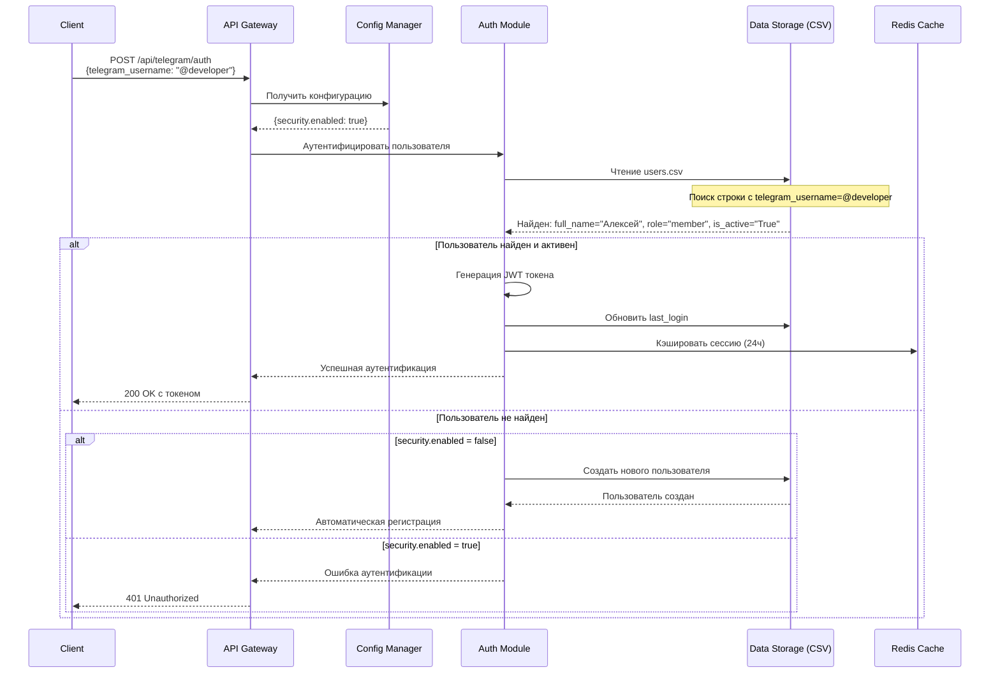

**Пример запроса**:

```json
{
  "telegram_username": "@developer_alex",
  "full_name": "Алексей Козлов"
}
```

**Пример ответа (успех)**:

```json
{
  "status": "success",
  "data": {
    "authenticated": true,
    "user": {
      "telegram_username": "@developer_alex",
      "full_name": "Алексей Козлов",
      "role": "member",
      "is_active": true,
      "last_login": "2024-01-15T10:30:00Z"
    },
    "session_token": "eyJhbGciOiJIUzI1NiIs...",
    "permissions": {
      "can_create_tasks": true,
      "can_edit_tasks": true,
      "can_delete_tasks": false,
      "can_export": false,
      "can_use_llm": true,
      "llm_daily_limit": 5
    }
  },
  "meta": {
    "timestamp": "2024-01-15T10:30:00Z",
    "request_id": "req_auth_123"
  }
}
```

**Параметры запроса**:

| Параметр            | Тип    | Обязательный | Описание                    | Валидация                    |
| ------------------- | ------ | ------------ | --------------------------- | ---------------------------- |
| `telegram_username` | String | Да           | Имя пользователя в Telegram | Начинается с @, 5-32 символа |
| `full_name`         | String | Нет          | Полное имя пользователя     | До 100 символов              |

## 4. Структуры CSV файлов

### 4.1 users.csv

**Пример содержимого**:

```csv
telegram_username,full_name,role,is_active,registered_at,last_login,email,department
@admin_ivan,Иван Петров,admin,True,2024-01-10 09:00:00,2024-01-15 14:20:00,ivan@company.com,IT
@manager_anna,Анна Сидорова,manager,True,2024-01-11 10:15:00,2024-01-15 15:30:00,anna@company.com,Project Management
@developer_alex,Алексей Козлов,member,True,2024-01-12 08:45:00,2024-01-15 16:45:00,alex@company.com,Development
@viewer_olga,Ольга Новикова,viewer,True,2024-01-13 11:30:00,2024-01-15 09:15:00,olga@company.com,Sales
@new_user,Новый Пользователь,member,False,2024-01-14 14:00:00,2024-01-14 14:00:00,new@company.com,Support
```

**Схема**:

| Колонка             | Тип      | Обязательная | Описание                                     | Пример                |
| ------------------- | -------- | ------------ | -------------------------------------------- | --------------------- |
| `telegram_username` | String   | Да           | Уникальный идентификатор пользователя        | `@developer_alex`     |
| `full_name`         | String   | Да           | Полное имя пользователя                      | `Алексей Козлов`      |
| `role`              | String   | Да           | Роль: `admin`, `manager`, `member`, `viewer` | `member`              |
| `is_active`         | Boolean  | Да           | Активен ли пользователь                      | `True`                |
| `registered_at`     | DateTime | Да           | Дата регистрации                             | `2024-01-15 10:30:00` |
| `last_login`        | DateTime | Нет          | Последний вход                               | `2024-01-15 14:20:00` |
| `email`             | String   | Нет          | Email пользователя                           | `alex@company.com`    |
| `department`        | String   | Нет          | Отдел                                        | `Development`         |

### 4.2 tasks.csv

**Пример содержимого**:

```csv
task_id,title,description,status,assignee,creator,created_at,updated_at,due_date,completed_at,priority,tags
101,Разработка REST API,Создать API endpoints для системы управления задачами,in_progress,@developer_alex,@manager_anna,2024-01-15 10:00:00,2024-01-15 16:00:00,2024-01-20,,high,"[""backend"",""api"",""priority""]"
102,Исправить критический баг,Ошибка при сохранении данных в CSV,done,@developer_alex,@admin_ivan,2024-01-14 09:30:00,2024-01-15 11:45:00,2024-01-16,2024-01-15 11:30:00,urgent,"[""bug"",""critical"",""hotfix""]"
103,Обновить документацию,Добавить новые API методы в документацию,todo,@developer_alex,@manager_anna,2024-01-15 14:00:00,2024-01-15 14:00:00,2024-01-25,,medium,"[""docs"",""api""]"
104,Дизайн Kanban доски,Создать UI для канбан доски,todo,,@manager_anna,2024-01-15 15:00:00,2024-01-15 15:00:00,2024-01-30,,medium,"[""frontend"",""ui"",""design""]"
```

**Схема**:

| Колонка        | Тип         | Обязательная | Описание                                     | Пример                           |
| -------------- | ----------- | ------------ | -------------------------------------------- | -------------------------------- |
| `task_id`      | Integer     | Да           | Уникальный ID задачи                         | `101`                            |
| `title`        | String      | Да           | Заголовок задачи                             | `Разработка API`                 |
| `description`  | String      | Нет          | Описание задачи                              | `Создать REST API для системы`   |
| `status`       | String      | Да           | Статус: `todo`, `in_progress`, `done`        | `in_progress`                    |
| `assignee`     | String      | Нет          | telegram_username назначенного               | `@developer_alex`                |
| `creator`      | String      | Да           | telegram_username создателя                  | `@manager_anna`                  |
| `created_at`   | DateTime    | Да           | Дата создания                                | `2024-01-15 10:00:00`            |
| `updated_at`   | DateTime    | Да           | Дата обновления                              | `2024-01-15 14:00:00`            |
| `due_date`     | Date        | Нет          | Дата дедлайна                                | `2024-01-20`                     |
| `completed_at` | DateTime    | Нет          | Дата завершения                              | `2024-01-18 16:30:00`            |
| `priority`     | String      | Да           | Приоритет: `low`, `medium`, `high`, `urgent` | `high`                           |
| `tags`         | JSON String | Нет          | Метки в JSON формате                         | `["backend", "api", "priority"]` |

### 4.3 events.csv

**Пример содержимого**:

```csv
event_id,title,description,start_time,end_time,creator,participants,created_at,location
201,Еженедельное совещание,Обсуждение текущих задач и планов,2024-01-16 10:00:00,2024-01-16 11:00:00,@manager_anna,"[""@developer_alex"",""@admin_ivan""]",2024-01-15 09:00:00,Конференц-зал
202,Ревью кода,Ревью новой функциональности API,2024-01-17 14:00:00,2024-01-17 15:30:00,@developer_alex,"[""@manager_anna"",""@admin_ivan""]",2024-01-15 11:30:00,Переговорная 3
203,Обучение новичков,Введение в систему для новых сотрудников,2024-01-18 09:30:00,2024-01-18 12:00:00,@admin_ivan,"[""@new_user""]",2024-01-15 13:45:00,Тренинг-зал
```

**Схема**:

| Колонка        | Тип         | Обязательная | Описание                    | Пример                           |
| -------------- | ----------- | ------------ | --------------------------- | -------------------------------- |
| `event_id`     | Integer     | Да           | Уникальный ID события       | `201`                            |
| `title`        | String      | Да           | Название события            | `Совещание по проекту`           |
| `description`  | String      | Нет          | Описание события            | `Еженедельное совещание команды` |
| `start_time`   | DateTime    | Да           | Начало события              | `2024-01-16 10:00:00`            |
| `end_time`     | DateTime    | Да           | Окончание события           | `2024-01-16 11:00:00`            |
| `creator`      | String      | Да           | telegram_username создателя | `@manager_anna`                  |
| `participants` | JSON String | Нет          | Участники в JSON формате    | `["@developer_alex", "@admin"]`  |
| `created_at`   | DateTime    | Да           | Дата создания записи        | `2024-01-15 09:00:00`            |
| `location`     | String      | Нет          | Место проведения            | `Конференц-зал`                  |

### 4.4 docs.csv

**Пример содержимого**:

```csv
doc_id,title,content,file_path,creator,created_at,updated_at,access_level,version
301,API Documentation,"Полное описание REST API методов системы...",/docs/api_v1.md,@developer_alex,2024-01-15 11:00:00,2024-01-15 15:00:00,team,1.2
302,User Guide,Руководство пользователя по работе с системой,/docs/user_guide.pdf,@manager_anna,2024-01-14 10:30:00,2024-01-15 12:15:00,public,1.0
303,Architecture Design,Архитектурная документация системы,,@admin_ivan,2024-01-13 14:45:00,2024-01-13 14:45:00,private,0.9
304,Meeting Notes,Заметки с еженедельного совещания,"Обсудили новые требования...",,@manager_anna,2024-01-15 16:30:00,2024-01-15 16:30:00,team,1.0
```

**Схема**:

| Колонка        | Тип      | Обязательная | Описание                                     | Пример                           |
| -------------- | -------- | ------------ | -------------------------------------------- | -------------------------------- |
| `doc_id`       | Integer  | Да           | Уникальный ID документа                      | `301`                            |
| `title`        | String   | Да           | Название документа                           | `Техническая документация API`   |
| `content`      | Text     | Нет          | Содержимое документа                         | `Полное описание API методов...` |
| `file_path`    | String   | Нет          | Путь к файлу                                 | `/docs/api_v1.pdf`               |
| `creator`      | String   | Да           | telegram_username создателя                  | `@developer_alex`                |
| `created_at`   | DateTime | Да           | Дата создания                                | `2024-01-15 11:00:00`            |
| `updated_at`   | DateTime | Да           | Дата обновления                              | `2024-01-15 15:00:00`            |
| `access_level` | String   | Да           | Уровень доступа: `public`, `team`, `private` | `team`                           |
| `version`      | String   | Нет          | Версия документа                             | `1.2`                            |

## 5. API управления задачами

### 5.1 GET /api/tasks - Получение списка задач

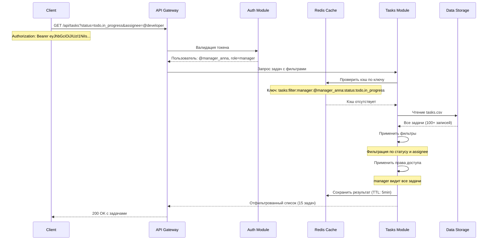

**Параметры запроса**:

| Query параметр | Тип     | Описание               | Пример                      | По умолчанию    |
| -------------- | ------- | ---------------------- | --------------------------- | --------------- |
| `status`       | String  | Фильтр по статусу      | `?status=todo,in_progress`  | Все статусы     |
| `assignee`     | String  | Фильтр по назначенному | `?assignee=@developer_alex` | Все назначенные |
| `creator`      | String  | Фильтр по создателю    | `?creator=@manager_anna`    | Все создатели   |
| `priority`     | String  | Фильтр по приоритету   | `?priority=high,urgent`     | Все приоритеты  |
| `date_from`    | String  | Задачи с даты          | `?date_from=2024-01-01`     | Нет ограничения |
| `date_to`      | String  | Задачи до даты         | `?date_to=2024-01-31`       | Нет ограничения |
| `limit`        | Integer | Ограничение количества | `?limit=50`                 | 100             |
| `offset`       | Integer | Смещение               | `?offset=100`               | 0               |
| `tags`         | String  | Фильтр по тегам        | `?tags=api,backend`         | Все теги        |

**Пример ответа**:

```json
{
  "status": "success",
  "data": {
    "tasks": [
      {
        "task_id": 101,
        "title": "Разработка REST API",
        "description": "Создать API endpoints для системы управления задачами",
        "status": "in_progress",
        "assignee": "@developer_alex",
        "assignee_name": "Алексей Козлов",
        "creator": "@manager_anna",
        "creator_name": "Анна Сидорова",
        "created_at": "2024-01-15T10:00:00Z",
        "updated_at": "2024-01-15T16:00:00Z",
        "due_date": "2024-01-20",
        "priority": "high",
        "tags": ["backend", "api", "priority"],
        "is_overdue": false,
        "days_remaining": 5
      }
    ],
    "pagination": {
      "total": 15,
      "page": 1,
      "per_page": 10,
      "total_pages": 2
    },
    "filters_applied": {
      "status": ["todo", "in_progress"],
      "assignee": "@developer_alex"
    }
  },
  "meta": {
    "timestamp": "2024-01-15T16:30:00Z",
    "request_id": "req_tasks_456"
  }
}
```

### 5.2 POST /api/tasks - Создание задачи

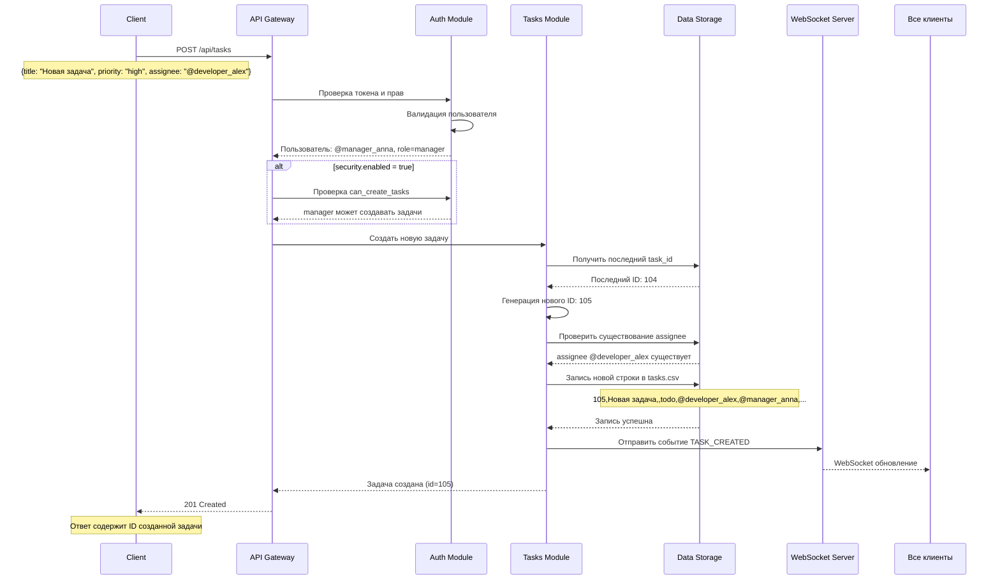

**Параметры запроса**:

| Параметр      | Тип    | Обязательный | Описание                       | Валидация                         |
| ------------- | ------ | ------------ | ------------------------------ | --------------------------------- |
| `title`       | String | Да           | Заголовок задачи               | 1-255 символов                    |
| `description` | String | Нет          | Описание задачи                | До 5000 символов                  |
| `priority`    | String | Нет          | Приоритет задачи               | `low`, `medium`, `high`, `urgent` |
| `assignee`    | String | Нет          | telegram_username назначенного | Должен существовать в users.csv   |
| `due_date`    | String | Нет          | Дата дедлайна                  | Формат: `YYYY-MM-DD`              |
| `tags`        | Array  | Нет          | Метки задачи                   | Массив строк до 10 элементов      |

**Пример запроса**:

```json
{
  "title": "Тестирование новой функциональности",
  "description": "Написать тесты для новых API endpoints",
  "priority": "medium",
  "assignee": "@developer_alex",
  "due_date": "2024-01-25",
  "tags": ["testing", "qa", "backend"]
}
```

**Пример ответа**:

```json
{
  "status": "success",
  "data": {
    "task_id": 105,
    "title": "Тестирование новой функциональности",
    "status": "todo",
    "assignee": "@developer_alex",
    "creator": "@manager_anna",
    "created_at": "2024-01-15T16:45:00Z",
    "message": "Задача успешно создана"
  },
  "meta": {
    "timestamp": "2024-01-15T16:45:00Z",
    "request_id": "req_create_789"
  }
}
```

### 5.3 PUT /api/tasks/{task_id} - Обновление задачи

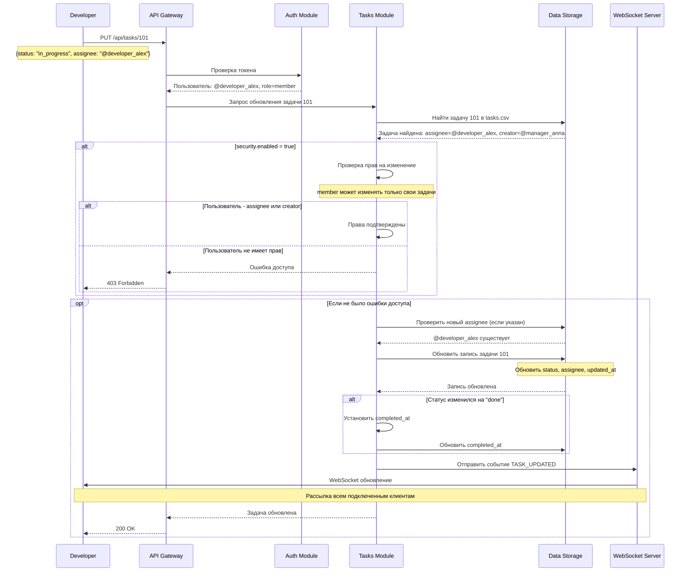

**Параметры запроса**:

| Параметр      | Тип    | Обязательный | Описание                       | Валидация                         |
| ------------- | ------ | ------------ | ------------------------------ | --------------------------------- |
| `title`       | String | Нет          | Заголовок задачи               | 1-255 символов                    |
| `description` | String | Нет          | Описание задачи                | До 5000 символов                  |
| `status`      | String | Нет          | Статус задачи                  | `todo`, `in_progress`, `done`     |
| `assignee`    | String | Нет          | telegram_username назначенного | Должен существовать в users.csv   |
| `due_date`    | String | Нет          | Дата дедлайна                  | Формат: `YYYY-MM-DD`              |
| `priority`    | String | Нет          | Приоритет задачи               | `low`, `medium`, `high`, `urgent` |
| `tags`        | Array  | Нет          | Метки задачи                   | Массив строк до 10 элементов      |

**Пример запроса**:

```json
{
  "status": "in_progress",
  "priority": "high",
  "tags": ["backend", "api", "in_progress"]
}
```

## 6. API экспорта данных

### 6.1 GET /api/export/tasks.csv - Экспорт задач в CSV

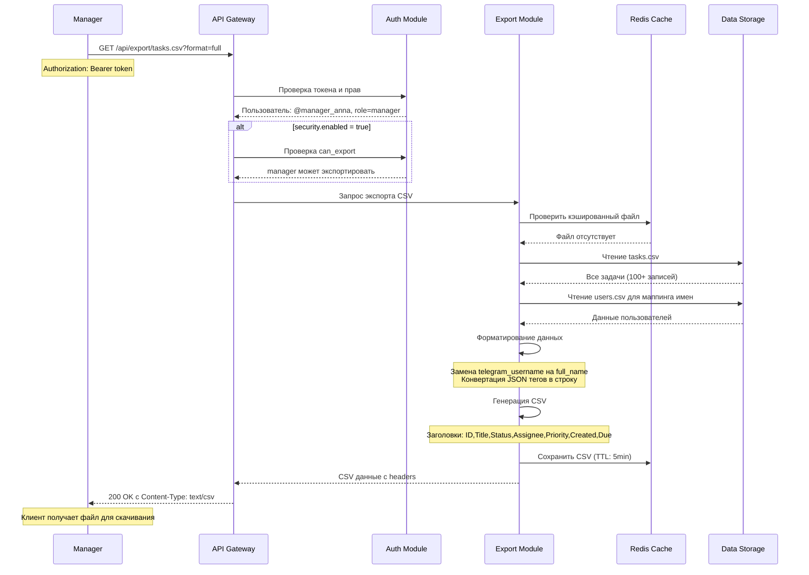

**Параметры запроса**:

| Query параметр  | Тип     | Описание                      | Пример                              | По умолчанию |
| --------------- | ------- | ----------------------------- | ----------------------------------- | ------------ |
| `format`        | String  | Формат экспорта               | `?format=simple`                    | `full`       |
| `time_period`   | String  | Период данных                 | `?time_period=last_week`            | Все данные   |
| `status`        | String  | Фильтр по статусу             | `?status=todo,in_progress`          | Все статусы  |
| `columns`       | String  | Выбираемые колонки            | `?columns=id,title,status,priority` | Все колонки  |
| `include_users` | Boolean | Включать данные пользователей | `?include_users=true`               | `false`      |

**Пример заголовков CSV файла**:

```
ID,Title,Description,Status,Assignee,Assignee Name,Creator,Creator Name,Created At,Updated At,Due Date,Completed At,Priority,Tags,Is Overdue,Days Remaining
```

### 6.2 GET /api/export/tasks.xlsx - Экспорт в Excel

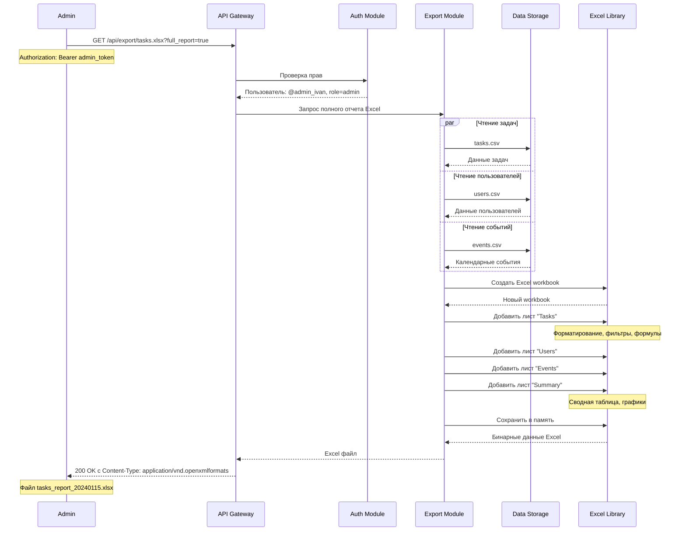

## 7. API LLM анализа

### 7.1 POST /api/llm/analyze/tasks - Анализ задач через AI

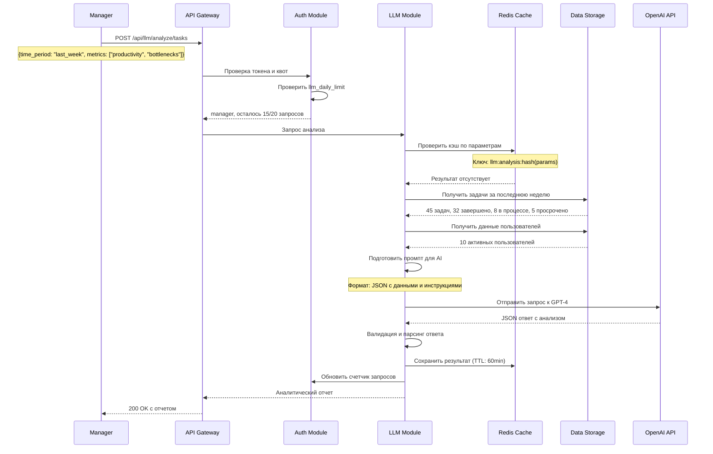

**Параметры запроса**:

| Параметр                  | Тип     | Обязательный | Описание                    | Допустимые значения                                              |
| ------------------------- | ------- | ------------ | --------------------------- | ---------------------------------------------------------------- |
| `time_period`             | String  | Да           | Период анализа              | `last_week`, `last_month`, `last_quarter`, `custom`              |
| `metrics`                 | Array   | Нет          | Метрики для анализа         | `productivity`, `bottlenecks`, `team_performance`, `predictions` |
| `format`                  | String  | Нет          | Формат ответа               | `json`, `markdown`                                               |
| `include_recommendations` | Boolean | Нет          | Включать рекомендации       | `true`, `false`                                                  |
| `custom_start`            | String  | Нет          | Начальная дата (при custom) | `YYYY-MM-DD`                                                     |
| `custom_end`              | String  | Нет          | Конечная дата (при custom)  | `YYYY-MM-DD`                                                     |

**Пример запроса**:

```json
{
  "time_period": "last_week",
  "metrics": ["productivity", "bottlenecks", "team_performance"],
  "format": "json",
  "include_recommendations": true
}
```

**Пример ответа**:

```json
{
  "status": "success",
  "data": {
    "report_id": "llm_rep_123456",
    "generated_at": "2024-01-15T17:00:00Z",
    "time_period": "2024-01-08 to 2024-01-15",
    "analysis": {
      "summary": {
        "total_tasks": 45,
        "completed": 32,
        "completion_rate": "71%",
        "in_progress": 8,
        "overdue": 5,
        "avg_completion_time": "2.3 days"
      },
      "productivity_metrics": {
        "top_performers": [
          {
            "username": "@developer_alex",
            "tasks_completed": 12,
            "completion_rate": "92%"
          },
          {
            "username": "@manager_anna",
            "tasks_completed": 10,
            "completion_rate": "100%"
          }
        ],
        "team_productivity_score": 7.8,
        "daily_completion_trend": [5, 7, 6, 8, 4, 3, 5]
      },
      "bottlenecks": [
        {
          "area": "code_review",
          "impact": "high",
          "avg_delay": "1.5 days",
          "affected_tasks": [101, 103, 107],
          "recommendation": "Внедрить автоматические проверки кода"
        },
        {
          "area": "documentation",
          "impact": "medium",
          "avg_delay": "0.8 days",
          "affected_tasks": [102, 105],
          "recommendation": "Создать шаблоны документации"
        }
      ],
      "team_performance": {
        "workload_distribution": {
          "@developer_alex": "35%",
          "@manager_anna": "25%",
          "others": "40%"
        },
        "collaboration_score": 6.2,
        "suggested_adjustments": [
          "Распределить нагрузку более равномерно",
          "Назначить ментора для новых сотрудников"
        ]
      }
    },
    "recommendations": [
      "Внедрить систему автоматических напоминаний о дедлайнах",
      "Установить лимит одновременно выполняемых задач (макс. 5 на человека)",
      "Проводить ежедневные стендапы для быстрого решения блокеров",
      "Создать шаблоны для часто повторяющихся задач"
    ],
    "predictions": {
      "next_week_completion": "38-42 задачи",
      "potential_bottlenecks": ["тестирование", "интеграция"],
      "suggested_actions": [
        "Начать работу над задачами с высоким приоритетом в начале недели",
        "Запланировать ревью кода на среду и пятницу"
      ]
    }
  },
  "meta": {
    "timestamp": "2024-01-15T17:00:00Z",
    "request_id": "req_llm_987",
    "tokens_used": 1450,
    "cache_hit": false,
    "llm_model": "gpt-4-turbo-preview"
  }
}
```

## 8. Управление пользователями

### 8.1 POST /api/users - Добавление нового пользователя

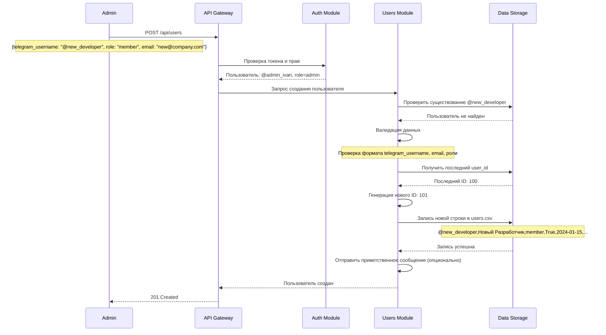

**Параметры запроса**:

| Параметр            | Тип     | Обязательный | Описание                    | Валидация                              |
| ------------------- | ------- | ------------ | --------------------------- | -------------------------------------- |
| `telegram_username` | String  | Да           | Имя пользователя в Telegram | Начинается с @, уникальное             |
| `full_name`         | String  | Да           | Полное имя пользователя     | 2-100 символов                         |
| `role`              | String  | Да           | Роль пользователя           | `admin`, `manager`, `member`, `viewer` |
| `email`             | String  | Нет          | Email пользователя          | Формат email                           |
| `department`        | String  | Нет          | Отдел                       | До 50 символов                         |
| `is_active`         | Boolean | Нет          | Активен ли пользователь     | `true`, `false`                        |

## 9. WebSocket соединения

### 9.1 Реальное обновление Kanban доски

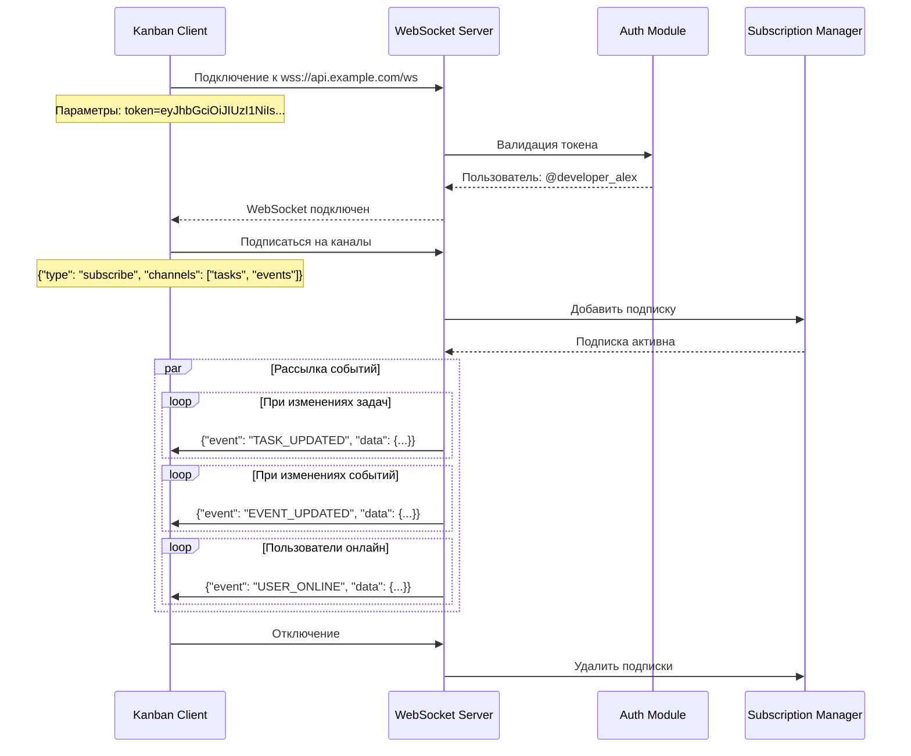

## 10. Полный рабочий цикл системы

### 10.1 Сценарий: Менеджер создает задачу и получает AI анализ

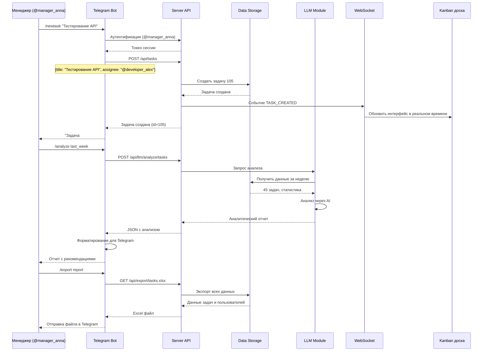

## 11. Мониторинг и метрики

### 11.1 Key Performance Indicators (KPI)

| Метрика                               | Формула расчета               | Целевое значение | Сбор данных        |
| ------------------------------------- | ----------------------------- | ---------------- | ------------------ |
| **Время отклика API**                 | `avg(response_time)`          | < 500ms          | Prometheus метрики |
| **Доступность системы**               | `uptime / total_time * 100%`  | > 99.5%          | Health checks      |
| **Количество активных пользователей** | `count(active_sessions)`      | > 0              | Redis отслеживание |
| **Скорость создания задач**           | `tasks_created / time_period` | 10-50/день       | CSV анализ         |
| **Процент завершенных задач**         | `completed / total * 100%`    | > 80%            | Еженедельный отчет |
| **Среднее время выполнения**          | `Σ(completion_time) / n`      | < 3 дней         | Анализ tasks.csv   |
| **Использование LLM**                 | `llm_requests / день`         | < 1000           | Квота по ролям     |
| **Размер данных**                     | `sum(file_sizes)`             | < 1GB            | Мониторинг диска   |

### 11.2 Структура логов

**Пример лог файла**:

```
2024-01-15 10:30:15 INFO [auth] Пользователь @developer_alex успешно аутентифицирован, роль: member, сессия: sess_abc123
2024-01-15 10:31:22 INFO [tasks] Задача #105 создана пользователем @manager_anna, заголовок: "Тестирование API"
2024-01-15 10:32:05 WARNING [security] Попытка доступа к /api/users пользователем @developer_alex (требуется admin)
2024-01-15 10:33:10 INFO [export] Экспорт tasks.csv выполнен пользователем @manager_anna, размер: 45 записей
2024-01-15 10:34:20 INFO [llm] LLM запрос выполнен для @manager_anna, модель: gpt-4, токены: 450, время: 2.3s
2024-01-15 10:35:30 ERROR [csv] Ошибка чтения файла tasks.csv: файл заблокирован, повторная попытка
2024-01-15 10:36:45 INFO [websocket] Новое соединение WebSocket от пользователя @developer_alex, активных: 5
```

Эта документация предоставляет полное описание архитектуры, API эндпоинтов, структур данных и рабочих процессов системы управления задачами. Все компоненты взаимодействуют через единый API с централизованной конфигурацией и поддержкой различных режимов безопасности.
